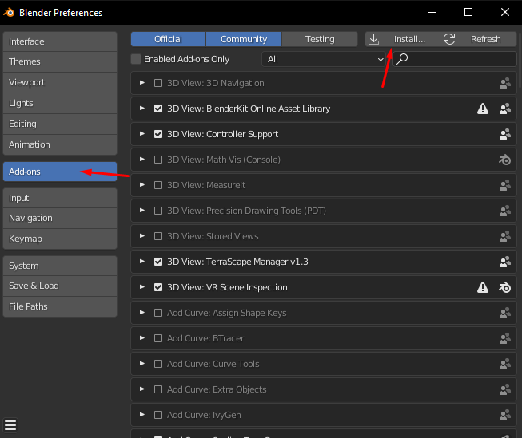
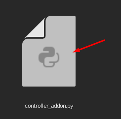
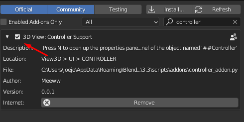
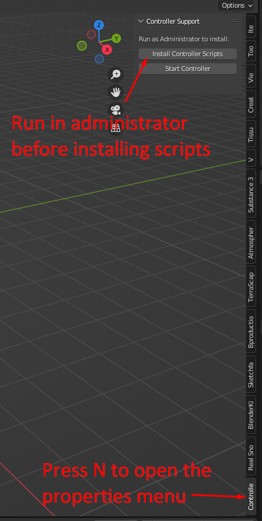
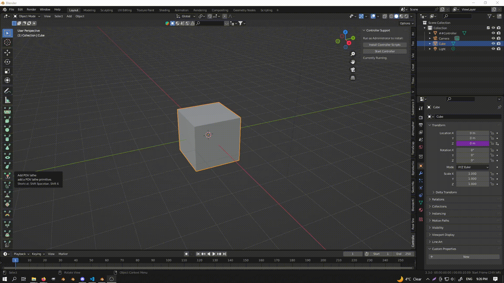
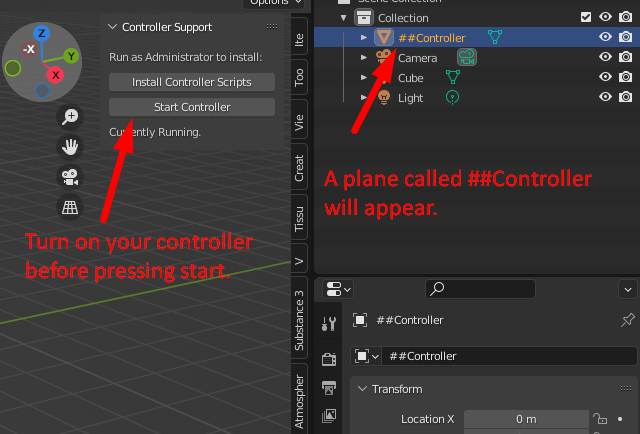
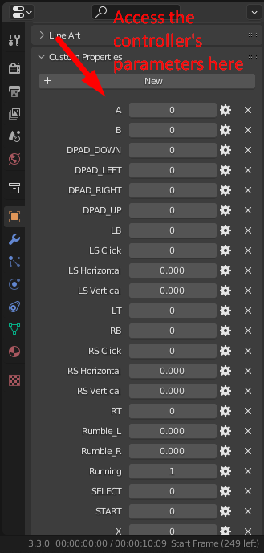
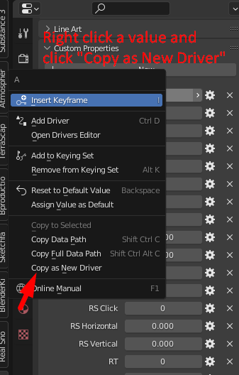
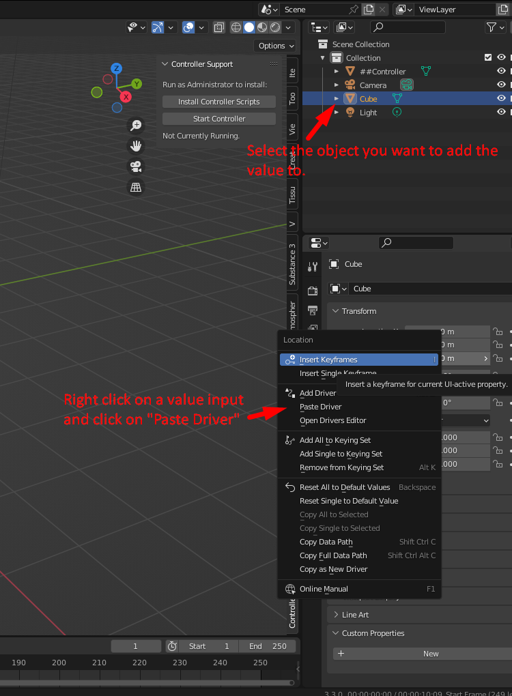

# Blender-Controller-Addon 

An addon that enable usage of a controller to control parameters inside of blender. 

## Installation

 How to install:

First download this addon by cloning this repository and extracting the zip to a folder.

| Open Add-ons Menu | Install Addon | Install Dependencies |
| :-: | :-: | :-: |
|   First open up the addons menu inside of blender under File > Preferences > Add-ons > Install... |   Inside the extracted zip folder, install the file called "controller_addon.py." Then enable the addon by click the checkbox next to "3D View: Controller Support".  |    Finally, restart blender (Run as Administrator!). Once it has opened, press n to open the properties panel. Scroll down and click Controller Support. In the opened panel click "Install Controller Scripts" and wait for it to finish installing. Once that's done you can restart blender (No more need for administrator), reopen the controller support panel, turn on your controller and press Start Controller. :) |

## Usage

 How to use:

| Activating the addon | Accessing the parameters | Adding Custom Drivers |
|:-:|:-:|:-:|
|    **Controlling Driver Nodes with Controller** 
     Activate the addon by pressing n, scrolling down to "Controller Support" and press "Start Controller."  |    You can access the controller's input and output values under the object properties panel in the "##Controller" object.  | **Copy Driver**    **Paste Driver**  |

Included are also a few example .blend files to demonstrate the addon's usefulness. The examples can be found under the examples folder.

Disclaimer

I have only been able to test this addon on an X-Box 360 Controller so other controllers may not work. If that is so please contact me and I will look into supporting them.

Feel free to use this any any of your projects! No payment necessary but donations on [gumroad](https://github.com/meeww/Blender-Controller-Addon) would be extremely appreciated!
